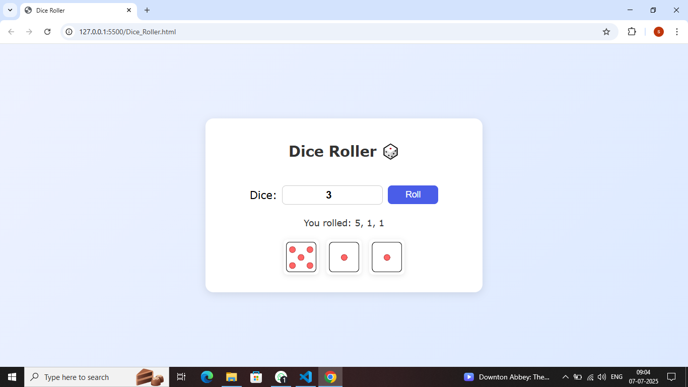

# 🎲 Dice Roller

A simple and interactive Dice Roller built with **HTML**, **CSS**, and **JavaScript**.  
Users can select how many dice to roll (up to 6) and get both the values and images for each roll.

---

## 🚀 Features

- 🎛️ Roll 1–6 dice at once
- 🖼️ Visual dice results with PNG images
- 💡 Clean UI with responsive layout
- ⚡ Instant roll using JavaScript
- ✅ No external libraries or frameworks

---

## 📂 Project Files

| File              | Description                            |
|-------------------|----------------------------------------|
| `Dice_Roller.html` | The main HTML structure                |
| `Dice_Roller.css`  | Styling and layout                     |
| `Dice_Roller.js`   | JavaScript logic for dice rolling      |
| `Dice/`            | Dice face images and preview screenshot|

---

## 📸 Preview



> 📍 Make sure your `Dice` folder includes all six dice face images (`1.png` to `6.png`).

---

## 🔧 How to Use

```bash
# 1. Clone this repository
git clone https://github.com/syedthedev/dice-roller.git

# 2. Open the folder
cd dice-roller

# 3. Run the app
Open Dice_Roller.html in your browser
